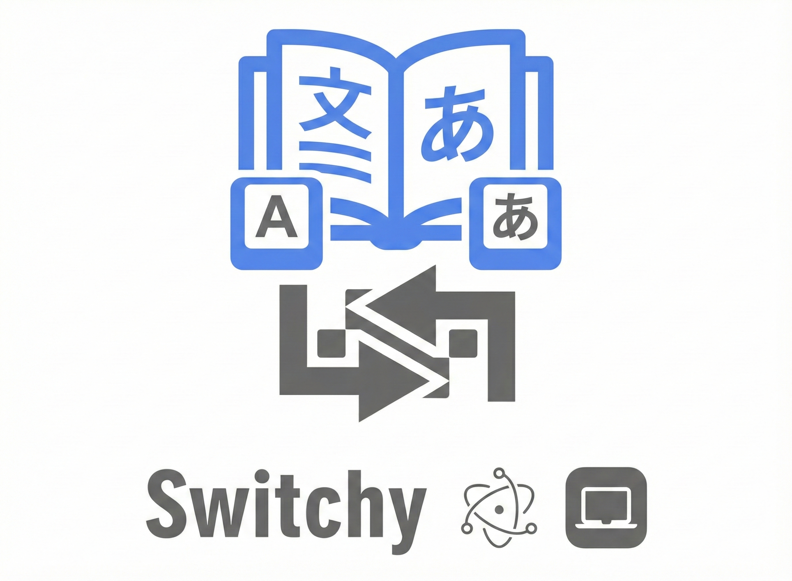

<div align="center">
  
  
  # Switchy
  
  **Smart keyboard layout converter for macOS & Windows**
  
  Never lose text typed in the wrong language again!
  
  [](https://github.com/mubtikr/switchy/actions)
  [](https://github.com/mubtikr/switchy/releases)
  [](LICENSE)
  [](https://github.com/mubtikr/switchy)
  
  [](https://www.typescriptlang.org/)
  [](https://www.electronjs.org/)
  [](https://github.com/mubtikr/switchy)
  [](CONTRIBUTING.md)
  
  [](https://github.com/mubtikr/switchy/stargazers)
  [](https://github.com/mubtikr/switchy/network/members)
  [](https://github.com/mubtikr/switchy/issues)
  [](https://github.com/mubtikr/switchy/pulls)
  
  [Features](#-features) • [Installation](#-installation) • [How It Works](#-how-it-works) • [Contributing](#-contributing)
  
</div>

---

## 💡 The Problem

Ever typed a whole sentence thinking you're on the English keyboard, only to realize you're still on Arabic layout? Or vice versa?

**Example:** You want to type "hello" but get "ويممخ" instead because you're on the Arabic keyboard.

## ✨ The Solution

Switchy intelligently detects your current keyboard layout and converts selected text to the correct language with a simple keyboard shortcut!

## 🚀 Features

- **🎯 Smart Auto-Convert**: Automatically detects your current keyboard layout and converts accordingly
- **⌨️ Global Shortcuts**: Works in any application - browsers, text editors, messaging apps
- **🔄 Real-time Layout Detection**: Always knows which keyboard layout you're using
- **🎨 System Tray Integration**: Runs quietly in the background
- **🌍 Multi-language Support**: 
  - Arabic ↔ English
  - French (AZERTY) ↔ English
  - Russian (ЙЦУКЕН) ↔ English
  - German (QWERTZ) ↔ English
  - Spanish (QWERTY España) ↔ English
- **⚡ Lightning Fast**: Native performance with Electron
- **🔌 Extensible**: Easy to add new language pairs

## 🎮 Default Shortcuts

| Shortcut (macOS) | Shortcut (Windows) | Action |
|------------------|-------------------|--------|
| `Cmd+Shift+Space` | `Ctrl+Shift+Space` | **Smart Convert** - Auto-detects layout and converts |
| `Cmd+Shift+E` | `Ctrl+Shift+E` | Force convert to English |
| `Cmd+Shift+A` | `Ctrl+Shift+A` | Force convert to Arabic |
| `Cmd+Shift+K` | `Ctrl+Shift+K` | Open converter window |

*All shortcuts are customizable in Settings*

## 📦 Installation

### Prerequisites

- macOS 10.13+ or Windows 10+
- Node.js 18+ and npm
- **Python 3.11** (required for building native dependencies like `robotjs` on Windows)
  - Python 3.12+ is not compatible with `node-gyp` due to the removal of the `distutils` module

### Development Setup

```bash
# Clone or navigate to the project
cd switchy

# Install dependencies
npm install

# Run in development mode
npm run dev

# Build for production
npm run build

# Package as macOS app
npm run package:mac
```

## 🔧 How It Works

1. **Select text** typed in the wrong language
2. **Press shortcut** (e.g., `Cmd+Shift+Space`)
3. **Switchy detects** your current keyboard layout
4. **Text is converted** and replaced automatically!

### Example Flow:
```
You're on Arabic keyboard → Type "hello" → Get "ويممخ" 
↓
Select "ويممخ" → Press Cmd+Shift+Space
↓
Switchy detects Arabic layout → Converts AR→EN → Replaces with "hello"
```

## 🔐 Permissions

Switchy requires **Accessibility permissions** to:
- Read selected text (via clipboard)
- Replace text automatically
- Work with global shortcuts

On first launch, you'll be prompted to grant permissions in:
**System Preferences → Security & Privacy → Accessibility**

## 🏗️ Project Structure

```
switchy/
├── src/
│   ├── main/              # Electron main process
│   │   ├── main.ts        # App entry point
│   │   ├── services/      # Core services
│   │   │   ├── LayoutDetector.ts      # Keyboard layout detection
│   │   │   ├── ConversionEngine.ts    # Text conversion logic
│   │   │   ├── TextReplacer.ts        # Selection replacement
│   │   │   └── SettingsManager.ts     # Settings persistence
│   │   ├── utils/         # Utilities
│   │   │   └── LanguageMaps.ts        # Character mappings
│   │   └── windows/       # Window management
│   ├── renderer/          # UI components
│   │   ├── converter/     # Converter popup
│   │   └── settings/      # Settings window
│   ├── preload/           # IPC bridge
│   └── shared/            # Shared types & constants
├── assets/                # Icons and resources
└── dist/                  # Build output
```

## 🛠️ Technology Stack

- **Electron** - Cross-platform desktop framework
- **TypeScript** - Type-safe development
- **Vite** - Fast build tool
- **Native APIs** - macOS keyboard layout detection

## 📝 Supported Languages

Currently supported language pairs:
- ✅ Arabic ↔ English
- 🔜 French ↔ English
- 🔜 Russian ↔ English

## 🤝 Contributing

Want to add a new language? Check out `src/main/utils/LanguageMaps.ts` for examples!

## 📄 License

MIT License - feel free to use and modify!

## 🐛 Troubleshooting

### Shortcuts not working?
- Check Accessibility permissions in System Preferences
- Make sure Switchy is running (check system tray)

### Text not converting?
- Ensure text is selected before pressing shortcut
- Check that the language pair is enabled in Settings

### App not starting?
- Check Console app for error logs
- Try: `npm run dev` to see detailed errors

## 🎯 Roadmap

- [ ] Windows support
- [ ] Linux support
- [ ] More language pairs
- [ ] Custom character mappings
- [ ] Phonetic conversion mode
- [ ] Auto-update mechanism

---

Made with ❤️ by developers who type in multiple languages
